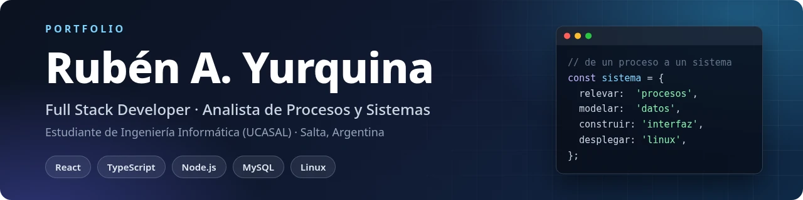
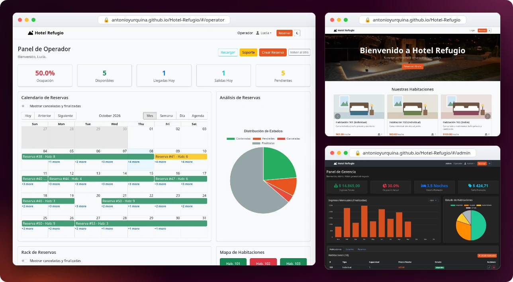
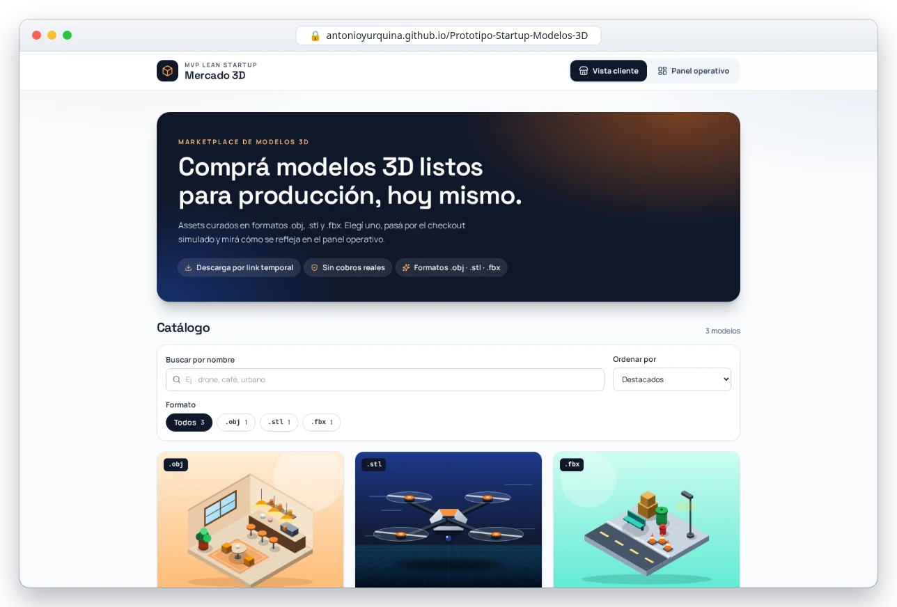
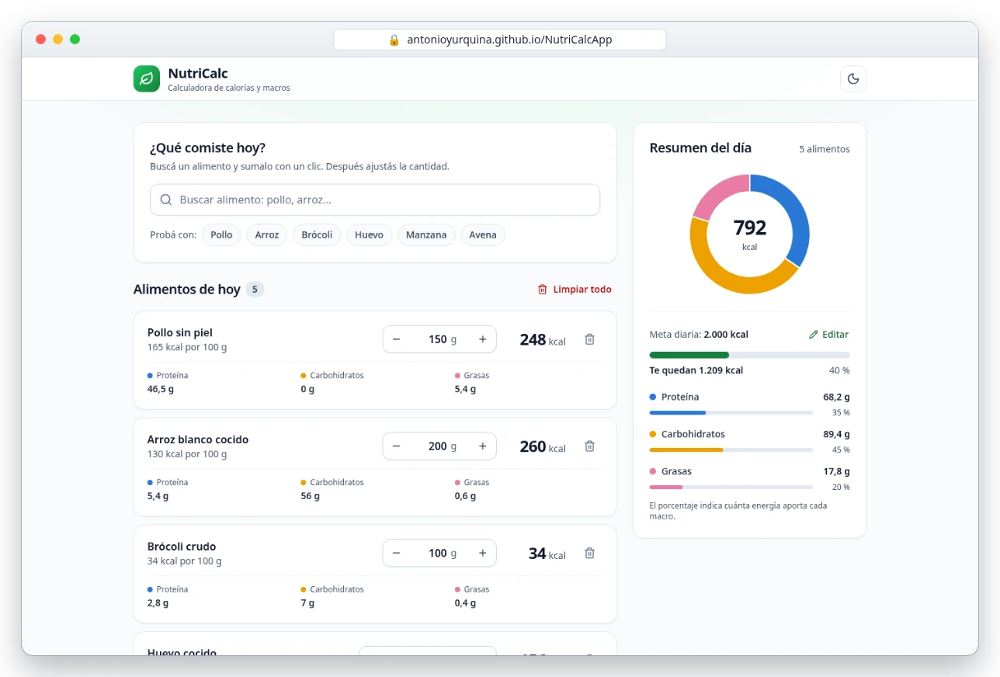
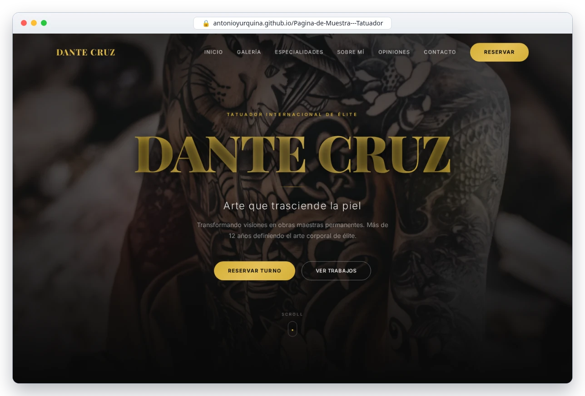
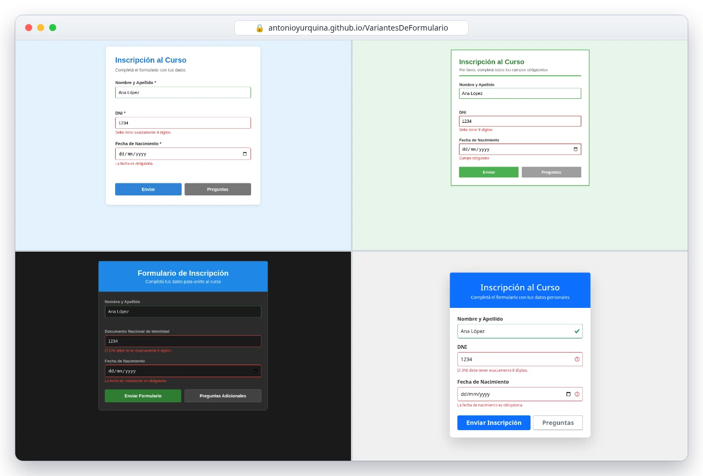

  

  
  

---

## Sobre mí

Convierto procesos reales en sistemas web que el equipo usa todos los días. Combino el análisis de procesos
(relevar cómo se trabaja, modelar el flujo, definir qué hay que controlar) con el desarrollo full stack:
del modelo de datos a la interfaz y el despliegue en Linux.

Vengo de la técnica en electrónica y de trabajos de administración (reservas, cobranzas, caja) y docencia,
así que conozco desde adentro los procesos que después sistematizo.

## En qué estoy ahora

- **Trabajo:** Analista de Procesos y Sistemas y desarrollador full stack (remoto) en una empresa de urbanizaciones.
  Diseño y mantengo un sistema web de administración de lotes financiados: cuotas, control de mora y caja diaria.
- **Freelance:** desarrollo web a medida desde 2024, con React/Vite y bases de datos relacionales.
- **Estudio:** 4.º año de Ingeniería Informática en UCASAL, con 35 de 60 materias aprobadas (58 %).
  Cursando Ingeniería de Software, Sistemas III, Redes II, Bases de Datos II, Lenguajes IV,
  Sistemas Operativos e Investigación Operativa II.

## Stack

**Frontend**

**Backend y datos**

**Herramientas**

También: SQL, UML, Apache.

## Proyectos públicos

Los sistemas de gestión que desarrollo para clientes son privados. Estos proyectos públicos muestran cómo
encaro la interfaz, el estado y la organización del código.

<table>
  <tr>
    <td colspan="2" valign="top">
      
      <h3>Hotel Refugio</h3>
      
Sistema de gestión hotelero (proyecto de la facultad) con tres frentes: sitio público con habitaciones y reservas, panel de operador con calendario, rack de reservas y mapa de habitaciones, y panel de gerencia con ingresos, ocupación y estadía promedio. Las capturas usan datos ficticios.

      
<code>React</code> <code>Vite</code> <code>Bootstrap</code> <code>Chart.js</code> <code>React Router</code>

      
<a href="https://github.com/AntonioYurquina/Hotel-Refugio">Código</a>

    </td>
  </tr>
  <tr>
    <td width="50%" valign="top">
      
      <h3>Mercado 3D</h3>
      
MVP de marketplace de modelos 3D: catálogo, checkout simulado y panel operativo con métricas de conversión.

      
<code>React</code> <code>Vite</code> <code>Tailwind</code>

      
<a href="https://antonioyurquina.github.io/Prototipo-Startup-Modelos-3D/">Demo</a> · <a href="https://github.com/AntonioYurquina/Prototipo-Startup-Modelos-3D">Código</a>

    </td>
    <td width="50%" valign="top">
      
      <h3>NutriCalc</h3>
      
Calculadora de consumo nutricional: buscador de alimentos, registro de comidas y resumen diario con gráficos.

      
<code>React</code> <code>Recharts</code> <code>Tailwind</code>

      
<a href="https://antonioyurquina.github.io/NutriCalcApp/">Demo</a> · <a href="https://github.com/AntonioYurquina/NutriCalcApp">Código</a>

    </td>
  </tr>
  <tr>
    <td width="50%" valign="top">
      
      <h3>Landing para tatuador</h3>
      
Landing page premium: diseño oscuro, animaciones, galería de trabajos, testimonios y formulario de contacto.

      
<code>React</code> <code>Tailwind</code> <code>Framer Motion</code>

      
<a href="https://antonioyurquina.github.io/Pagina-de-Muestra---Tatuador/">Demo</a> · <a href="https://github.com/AntonioYurquina/Pagina-de-Muestra---Tatuador">Código</a>

    </td>
    <td width="50%" valign="top">
      
      <h3>Variantes de formulario</h3>
      
Un mismo formulario con validación en JavaScript puro, resuelto en cuatro variantes visuales: moderno, minimalista, modo oscuro y Bootstrap.

      
<code>HTML</code> <code>CSS</code> <code>JavaScript</code>

      
<a href="https://antonioyurquina.github.io/VariantesDeFormulario/">Demo</a> · <a href="https://github.com/AntonioYurquina/VariantesDeFormulario">Código</a>

    </td>
  </tr>
</table>

## Contacto

Consultas de desarrollo web y sistemas de gestión a medida: [antonioyurquina.10@gmail.com](mailto:antonioyurquina.10@gmail.com).
